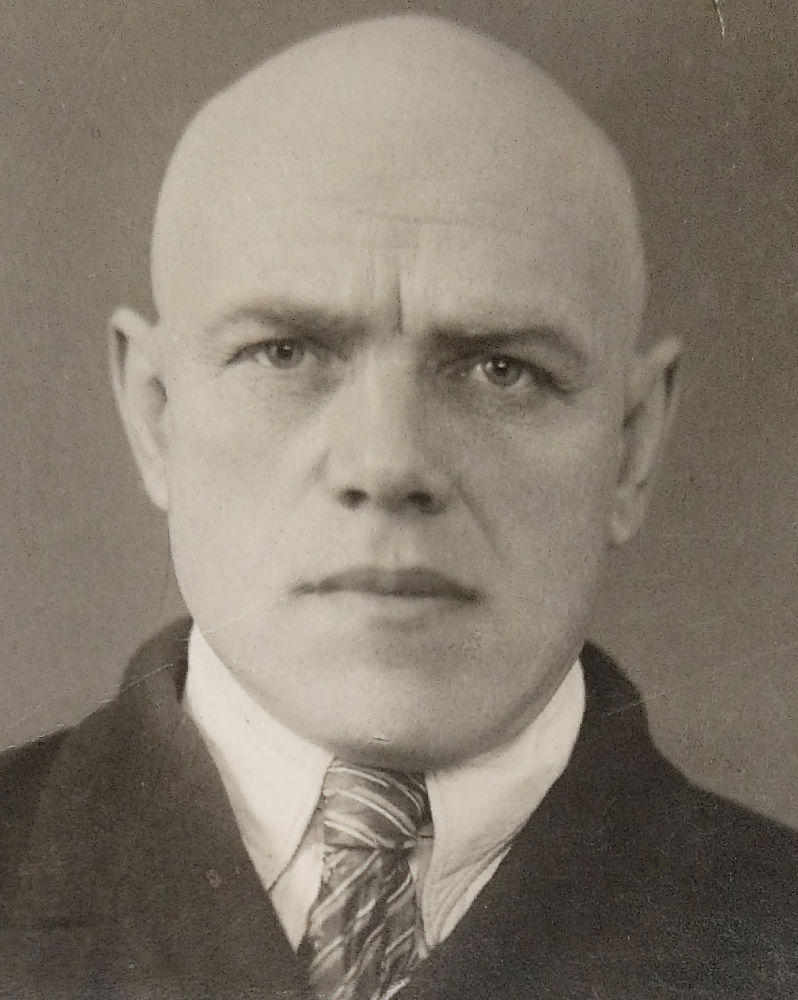

# Илья

Как говорят: "Ученье - свет" вот и я пошел учится, пусть моя специальность и даже близко не связана с программированием, а с мобильной разработкой тем более, но в какой то момент я понял, что работать за компом можно по разному и нет предела автоматизациям!

Мои основные навыки:
1. Умение учиться
1. Проактивное мышление
1. Критическое мышление
1. Творческое мышление
1. Красноречие
1. Эмпатия
1. Управление финансами
1. Тайм-менеджмент
1. Этих всех навыков у меня нет

